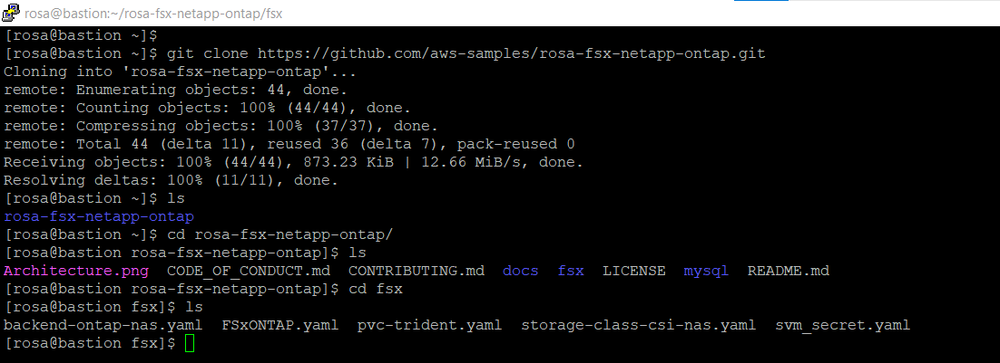

== ROSA FSX Workshop

This lab guide demonstrates the use of FSx for ONTAP as a persistent storage layer for ROSA applications. We’ll walk through a step-by-step installation of the NetApp Trident CSI driver on a ROSA cluster, provision an FSx for ONTAP file system, deploy a sample stateful application, and demonstrate pod scaling using dynamic persistent volumes. Finally, we’ll cover backup and restore for your application. With this solution, you can set up shared storage solution that scales across AZ and makes it easier to scale, protect, and restore your data using the Trident CSI driver.

NOTE: Red Hat associates that have access to the Red Hat Demo Platform (RHDP) can launch the ROSA FSx Workshop for a lab environment.

Once you have the lab environment ready,  SSH into the bastion and follow the steps below.

Steps: 

  . Clone GitHub repository
  . Provision FSx for ONTAP file system using CloudFormation
  . Install and configure the Trident CSI driver for ROSA cluster
  . Deploy sample MySQL stateful application on ROSA cluster
  . Scale MySQL application pods across multi-Availability Zones
  . Backup and restore volumes in the FSx for ONTAP file system

=== Clone GitHub repository

You will need Git to clone the github repository - https://github.com/aws-samples/rosa-fsx-netapp-ontap

If you do not have git, install it with your distro's package manager. 

Example:

[source,bash]
  sudo dnf install git -y

Clone the git repository:

[source,bash]
  git clone https://github.com/aws-samples/rosa-fsx-netapp-ontap.git

=== Provision FSx for ONTAP

We will create a singlemulti-AZ FSx for ONTAP file system in the same VPC as the ROSA cluster.

Take note of the VPC ID, 2 Subnet IDs corresponding to the subnets you want your file system to be in, as well as all route table IDs associated with the ROSA VPC subnets, and enter those values in the following command.

The FSxAllowedCIDR is the allowed CIDR range set up for the FSx for ONTAP security groups ingress rules to control the access. You could use 0.0.0.0/0 or any appropriate CIDR to allow all traffic to access the specific ports of FSx for ONTAP. Run the command in a terminal to create FSx for ONTAP file system.

NOTE: If you want to provision file system with different Storage Capacity and throughput, you can override the default values by setting StorageCapacity and ThroughputCapacity parameters in the CFN template.

[source,shell]
----
    cd rosa-fsx-netapp-ontap/fsx

    aws cloudformation create-stack \
        --stack-name ROSA-FSXONTAP \
        --template-body file://./FSxONTAP.yaml \
        --region us-east-2 \
        --parameters \   
        ParameterKey=Subnet1ID,ParameterValue=subnet-00b92c13e5106e6c8 \
        ParameterKey=myVpc,ParameterValue=vpc-064d62b2f37b01034 \
        ParameterKey=FileSystemName,ParameterValue=ROSA-myFSxONTAP \
        ParameterKey=ThroughputCapacity,ParameterValue=512 \
        ParameterKey=FSxAllowedCIDR,ParameterValue=10.0.0.0/16 \
        ParameterKey=FsxAdminPassword,ParameterValue=Rosa12345 \
        ParameterKey=SvmAdminPassword,ParameterValue=Rosa12345 \
        --capabilities CAPABILITY_NAMED_IAM
----

Verify your file system and storage virtual machine (SVM) has been created using the Amazon FSx console:

image::images/stack_volume_detailed.png[]

[[Install-Trident-CSI-Driver]]

== Install and configure the Trident CSI driver for ROSA cluster
We will be installing the Trident CSI driver in the Openshift “trident” namespace. To create the “trident” namespace, open a command line interface (CLI) on your computer and login to the ROSA cluster using the OpenShift CLI (oc) tool.

[source,shell]
----
oc create ns trident
----

Next, download the Trident CSI driver from git:

[source,shell]
----
curl -L -o trident-installer-22.10.0.tar.gz https://github.com/NetApp/trident/releases/download/v22.10.0/trident-installer-22.10.0.tar.gz
----

Then, extract the contents:

[source,shell]
----
tar -xvf ./trident-installer-21.10.1.tar.gz
----

Use the following helm command to install the Trident CSI driver in the “trident” namespace on the OpenShift cluster.

[source,shell]
----
cd trident-installer/helm 
helm install trident -n trident trident-operator-22.10.0.tgz
----

Run the following command to verify the Trident driver installation.

[source,shell]
----
helm status trident -n trident
----

image::images/trident_installation.png[igure 3 – Trident installation status]]

==  Create secret to store the SVM username and password in ROSA cluster

Create a new file with the SVM username and admin password, and save it as svm_secret.yaml. A sample svm_secret.yaml file is included in the fsx folder.

svm_secret.yaml

[source,yaml]

  apiVersion: v1
  kind: Secret
  metadata:
    name: backend-fsx-ontap-nas-secret
    namespace: trident
  type: Opaque
  stringData:
    username: vsadmin
    password: step#2 password

NOTE: The SVM username and its admin password have been created via step 2. You can retrieve it from the AWS Secrets Manager console as shown in the following screenshot:

image:images/svm_secrets_manager.png[SVM Secrets Manager]

Add the secrets to the ROSA cluster with the following command:

[source, bash]
oc apply -f svm_secret.yaml

To verify the secrets have been added to the ROSA cluster, run the following command.

[source, bash]
oc get secrets -n trident |grep backend-fsx-ontap-nas

[[Configure-Trident-Backend]]
=== Install and Configure Trident CSI backend to FSx for ONTAP
The Trident backend configuration tells the Trident how to communicate with the storage system (in this case, FSx for ONTAP). We’ll use the ontap-nas driver to provision storage volumes.

To get started, move into the `fsx` directory of your cloned git repository. Open the file `backend-ontap-nas.yaml`. Replace the `managementLIF` and `dataLIF` in that file with the Management DNS name and NFS DNS name of Amazon FSx Storage Virtual Machine and `svm` with SVM name as per the following screenshot.

NOTE: `ManagementLIF` and `DataLIF` can be found via the Amazon FSx Console under “Storage virtual machines” as shown in the following screenshot:

image::images/stack_volume_detailed.png[Figure 5 – Management LIF from SVM details page]

Now let’s execute the following commands in the terminal to configure the Trident backend in our ROSA cluster.

[source,shell]
----
cd fsx 
oc apply -f backend-ontap-nas.yaml
----

Verify the backend configuration.

[source,shell]
----
oc get tbc -n trident
----

After successful configuration of the trident backend, we will create a storage class that will use the backend we created above
[[Create-Storage-Class]]
=== Create storage class in ROSA cluster
Now, let’s create the storage class.

[source,shell]
----
oc apply -f storage-class-csi-nas.yaml
----

Verify the status of the trident-csi storage class creation.

[source,shell]
----
oc get sc
----

This completes installation of Trident CSI driver and its connectivity to FSx for ONTAP file system. Now we’ll deploy a sample MySQL stateful application on ROSA using file volumes in FSx for ONTAP.

NOTE: If you want to verify applications can create PV using trident operator, create PVC using the `pvc-trident.yaml` file provided in `fsx` folder.
[[Deploy-MySQL-Application]]
=== Deploy sample MySQL stateful application
In this section, we will deploy the highly available MySQL application onto the ROSA cluster using a Kubernetes StatefulSet and have the PersistentVolume provisioned by Trident. Kubernetes StatefulSet ensures the original PersistentVolume (PV) is mounted on the same pod identity when it’s rescheduled again to retain data integrity and consistency. For more information about the MySQL application replication configuration, please refer to the link:https://dev.mysql.com/doc/refman/8.0/en/replication.html[MySQL Official document].

Before we begin with MySQL application deployment, we’ll store the application’s sensitive information like username and password in Secrets. Here, we’ll be creating simple secrets.

Open the `mysql` folder in your cloned git repository, review the file `mysql-secrets.yaml` file, and execute the following command to create the secret.

[source,shell]
----
cd mysql
oc create namespace mysql
oc apply -f mysql-secrets.yaml
----

Now, verify the secrets were created.

[source,shell]
----
oc get secrets -n mysql
----

image::images/mysql_secrets.png[]

Now we’ll deploy MySQL StatefulSet application on the ROSA cluster. Open `mysql/mysql-statefulset.yaml` and review the details –metadata, replicas, and storageclass name. Then, execute the following command.

[source,shell]
----
oc apply -f mysql-statefulset.yaml
----

Verify the application deployment.

[source,shell]
----
oc get pods -n mysql
----

##. Get screenshot for this section

Verify the PVCs are created by the MySQL application.

[source,shell]
----
oc get pvc -n mysql
----

image::images/oc_get_pvc_mysql.png[]

[[Create-Service-StatefulSet]]

=== Create a service for the StatefulSet application
A Kubernetes service defines logical set of pods and a policy to access pods. StatefulSet currently requires a headless service to control the domain of its pods, directly reaching each pod with stable DNS entries. By specifying “None” for the clusterIP, you can create a headless service.

[source,shell]
----
oc apply -f mysql-service.yaml
----

Verify the service.

[source,shell]
----
oc get svc -n mysql
----

image::images/oc_apply_svc_mysql.png[]

[[Create-MySQL-Client]]

=== Create MySQL client for MySQL

The MySQL client is for us to access the MySQL applications that we just deployed. Review the content mysql-client.yaml. Deploy MySQL client using the following command.

[source,shell]
----
oc apply -f mysql-client.yaml
----

Verify the pod status.

[source,shell]
----
oc get pods
----

Log in to the MySQL client pod.

[source,shell]
----
oc exec --stdin --tty mysql-client -- sh
----

Then, Install the MySQL client tool.

[source,shell]
----
apk add mysql-client
----

Within the mysql-client pod, connect to the MySQL server.

[source,shell]
----
mysql -u root -p -h mysql-set-0.mysql.mysql.svc.cluster.local
----

Enter the password that is stored in the mysql-secrets.yaml. Once connected, Create a database on the MySQL database.

[source,sql]
----
MySQL [(none)]> CREATE DATABASE erp;
MySQL [(none)]> CREATE TABLE erp.Persons ( ID int, FirstName varchar(255),Lastname varchar(255)); 
MySQL [(none)]> INSERT INTO erp.Persons (ID, FirstName, LastName) values (1234 , "John" , "Doe");
MySQL [(none)]> commit;

MySQL [(none)]> select * from erp.Persons;
+------+-----------+----------+
| ID | FirstName | Lastname |
+------+-----------+----------+
| 1234 | John | Doe |
+------+-----------+----------+
----
[[Scaling-StatefulSet-Pods]]
=== Scaling StatefulSet pods
You can easily scale the MySQL StatefulSet application using the following command.

[source,shell]
----
oc scale statefulsets mysql-set --replicas=4 -n mysql
----

Check the number of pods running using this command

[source,shell]
----
oc get pods -n mysql
----

This demonstrates the horizontal scaling of Statefulset pods.
[[FSx-Snapshots]]
=== FSx for ONTAP snapshots
FSx for ONTAP supports snapshots, which are point-in-time read-only images of your volumes that consume minimal space and can be created near-instantly. You can use snapshots to create online backups of your data that are stored within the volume itself.

Check out the blog link:https://aws.amazon.com/blogs/storage/run-containerized-applications-efficiently-using-amazon-fsx-for-netapp-ontap-and-amazon-eks/[“Run containerized applications efficiently using Amazon FSx for NetApp ONTAP and Amazon EKS”] to backup and restore data persistent volumes with FSx for ONTAP. We will walk through how to leverage the FSx for ONTAP snapshot feature to instantly restore data on ROSA cluster.
== Delete the database "erp"

To delete the database "erp" after creating a snapshot (backup) in 6.1, follow these steps:

1. Log into the container console using a new terminal. Please note that this is not the same as the one used in 6.1.

[source,bash]
----
oc exec --stdin --tty mysql-client -n mysql -- sh
mysql -u root -p -h mysql-set-0.mysql.mysql.svc.cluster.local
----

2. You will be prompted to enter the MySQL root password. After entering the password, you'll get into the MySQL command-line interface.

3. Delete the "erp" database.

[source,sql]
----
MySQL [(none)]> DROP DATABASE erp;
----

4. After executing the DROP command, the database "erp" will be deleted, and you should see a message like:

[source]
----
Query OK, 1 row affected
----

Remember, before deleting any database, ensure that you have a proper backup of the data and are certain that you want to proceed with the deletion.
== Restore the snapshot `backup_point_01` from SVM

To restore the volume with the snapshot `backup_point_01` that you created earlier, follow these steps:

1. Go back to the ONTAP CLI.

2. Use the `snap restore` command with the appropriate arguments to perform the restore.

[source,bash]
----
SVM1::> snap restore -volume trident_pvc_81731fc1_7e84_4f4f_9525_fb16125aeba0 -snapshot backup_point_01
----

Make sure to replace `trident_pvc_81731fc1_7e84_4f4f_9525_fb16125aeba0` with the actual volume name you want to restore.

This command will restore the volume with the contents from the `backup_point_01` snapshot.

Remember to verify the restoration to ensure that the volume is restored successfully.

== Validate the Database Restored Immediately ==
Given we just restored the database in 6.3, we will validate the database is restored as expected.

Go back to the container console in 6.2:

== Show Databases ==
[source,sql]
----
MySQL [(none)]> SHOW DATABASES;
+--------------------+
| Database           |
+--------------------+
| erp                |
+--------------------+
----

== Select from erp.Persons ==
[source,sql]
----
MySQL [(none)]> select * from erp.Persons;
+------+-----------+----------+
| ID   | FirstName | Lastname |
+------+-----------+----------+
| 1234 | John      | Doe      |
+------+-----------+----------+
----
