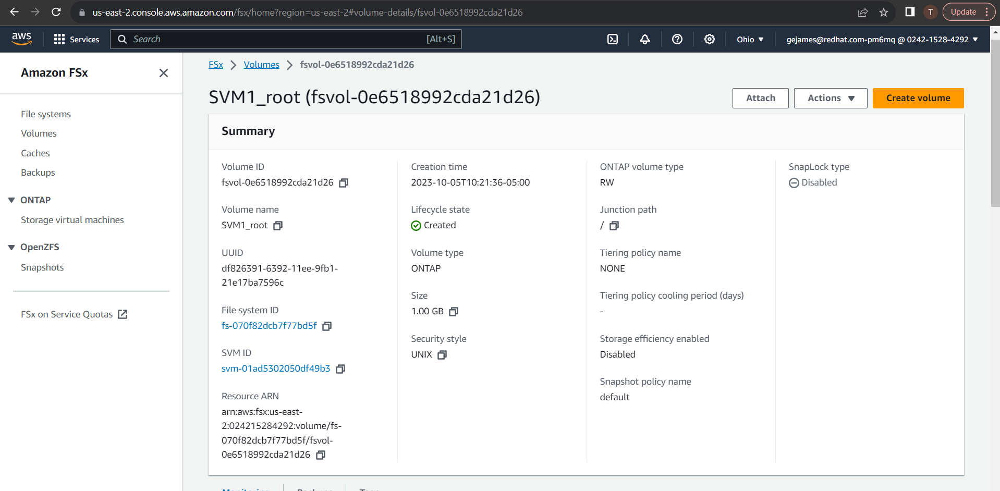
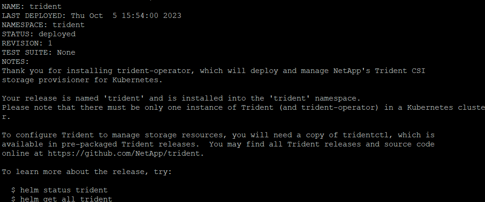
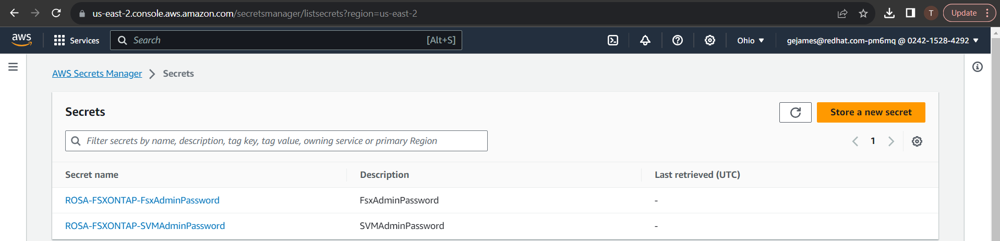
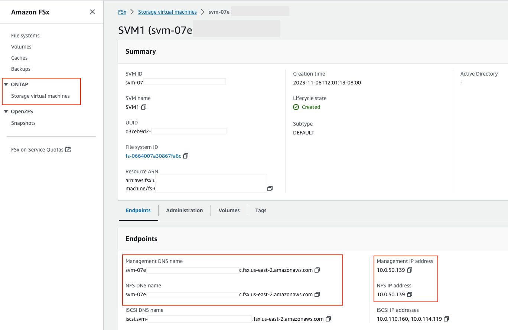
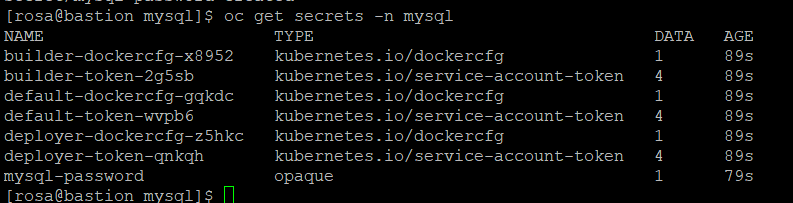
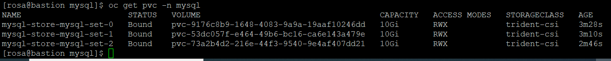
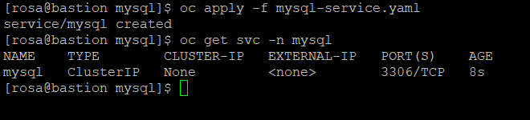

= ROSA FSX Workshop

This lab guide demonstrates the use of FSx for ONTAP as a persistent storage layer for ROSA applications. We’ll walk through a step-by-step installation of the NetApp Trident CSI driver on a ROSA cluster, provision an FSx for ONTAP file system, deploy a sample stateful application, and demonstrate pod scaling using dynamic persistent volumes. Finally, we’ll cover backup and restore for your application. With this solution, you can set up shared storage solution that scales across AZ and makes it easier to scale, protect, and restore your data using the Trident CSI driver.

NOTE: Red Hat associates that have access to the Red Hat Demo Platform (RHDP) can launch the ROSA FSx Workshop for a lab environment.

This lab guide assumes you are using the RHDP environment.

Once you have the lab environment ready,  SSH into the bastion and follow the steps below.

Steps: 

  . <<#clone_github>>
  . <<#provision_fsx>>
  . <<#config_trident>>
  . <<#deploy_mysql>>
  . <<#scale_mysql_pods>>
  . <<#backup_restore>>

== Clone GitHub repository [[clone_github]]

You will need Git to clone the github repository - https://github.com/redhat-gpst/rosa-fsx.git

If you do not have git, install it with your distro's package manager. 

Clone the git repository:

[source,bash]
  git clone https://github.com/redhat-gpst/rosa-fsx.git

cd into the rosa-fsx/fsx directory

[source,shell]
----
    cd ~/rosa-fsx/fsx
----

== Provision FSx for ONTAP [[provision_fsx]]

We will create a single-AZ FSx for ONTAP file system in the same VPC as the ROSA cluster.

From the bastion, run the following command.  

[source,bash]
----
aws ec2 describe-subnets --query 'Subnets[*].{SubnetId:SubnetId,VpcId:VpcId,CidrBlock:CidrBlock}' \
   --output table
----

Output:

----
-------------------------------------------------------------------------
|                             DescribeSubnets                           |
+----------------+----------------------------+-------------------------+
|    CidrBlock   |         SubnetId           |          VpcId          |
+----------------+----------------------------+-------------------------+
|  10.0.0.0/17   |  subnet-0c1e3b083f692a17f  |  vpc-0994809fd6f55252b  |
|  192.168.0.0/24|  subnet-01b8fa59d97657eca  |  vpc-0a4106cf5b3b895b5  |
|  10.0.128.0/17 |  subnet-0299fe13ba470aa9f  |  vpc-0994809fd6f55252b  |
+----------------+----------------------------+-------------------------+
----

Run the following command to assign the SubnetId to SUBNETID

[source,bash]
----
export SUBNETID=$(aws ec2 describe-subnets --query 'Subnets[?CidrBlock==`10.0.0.0/17`].SubnetId' \
   --output json | jq -r '.[0]')
----

Run the following command to assign the VpcId to VPCID

[source,bash]
----
export VPCID=$(aws ec2 describe-subnets --query 'Subnets[?CidrBlock==`10.0.0.0/17`].VpcId' \
   --output json | jq -r '.[0]')
----

Run the following command to create the stack

[source,shell]
----
aws cloudformation create-stack \
  --stack-name ROSA-FSXONTAP \
  --template-body file://./FSxONTAP.yml \
  --region us-east-2 \
  --parameters \   
     ParameterKey=Subnet1ID,ParameterValue=$SUBNETID \
     ParameterKey=myVpc,ParameterValue=$VPCID \
     ParameterKey=FileSystemName,ParameterValue=ROSA-myFSxONTAP \
     ParameterKey=ThroughputCapacity,ParameterValue=512 \
     ParameterKey=FSxAllowedCIDR,ParameterValue=10.0.0.0/16 \
     ParameterKey=FsxAdminPassword,ParameterValue=Rosa12345 \
     ParameterKey=SvmAdminPassword,ParameterValue=Rosa12345 \
  --capabilities CAPABILITY_NAMED_IAM
----
NOTE: You can monitor the progress of the stack creation from AWS Console -> CloudFormation -> Stacks -> ROSA-FSXONTAP

Verify your file system and storage virtual machine (SVM) has been created using the Amazon FSx console. 

== Install and configure the Trident CSI driver for ROSA [[config_trident]]

In order to use the `oc` command, you may have to first login.  

Visit the OCP Web UI for the API URL.  Then use the API URL to login.

Example:

[source, bash]
----
[rosa@bastion]$ oc login https://api.rosa-6slmk.qkm6.p1.openshiftapps.com:6443
You must obtain an API token by visiting https://oauth-openshift.apps.rosa-6slmk.qkm6.p1.openshiftapps.com/oauth/token/request

[rosa@bastion]$ oc login --token=sha256~Bt3c-m2dTmmHqGlo-xxxxxxxxxxxxxxxxxxxxxxxx --server=https://api.rosa-6slmk.qkm6.p1.openshiftapps.com:6443

Logged into "https://api.rosa-6slmk.qkm6.p1.openshiftapps.com:6443" as "cluster-admin" using the token provided.

You have access to 100 projects, the list has been suppressed. You can list all projects with 'oc projects'
----

We will be installing the Trident CSI driver in the Openshift “trident” namespace. 

[source,shell]
----
oc create ns trident
----

Next, download the Trident CSI driver from git:

[source,shell]
----
cd ~/rosa-fsx/fsx/
curl -L -o trident-installer.tar.gz \ 
  https://github.com/NetApp/trident/releases/download/v22.10.0/trident-installer-22.10.0.tar.gz
----

Then, extract the contents:

[source,shell]
----
tar -xvf ./trident-installer.tar.gz
----

Use the following helm command to install the Trident CSI driver in the “trident” namespace on the OpenShift cluster.

[source,shell]
----
cd ~/rosa-fsx/fsx/trident-installer/helm 
helm install trident -n trident trident-operator-22.10.0.tgz
----

Run the following command to verify the Trident driver installation.

[source,shell]
----
helm status trident -n trident
----

]

=== Create secret to store the SVM username and password in ROSA cluster

Create a new file with the SVM username and admin password, and save it as `svm_secret.yml`. 

A sample `svm_secret.yml` file is included in the fsx folder.

[source,yaml]
----
apiVersion: v1
kind: Secret
metadata:
  name: backend-fsx-ontap-nas-secret
  namespace: trident
type: Opaque
stringData:
  username: vsadmin
  password: Rosa12345
----

Add the secrets to the ROSA cluster with the following command:

[source, bash]
oc apply -f svm_secret.yml

To verify the secrets have been added to the ROSA cluster, run the following command.

[source,bash]
----
oc get secrets -n trident | awk '/NAME|backend-fsx-ontap-nas-secret/'
----
[listing]
----
NAME                                 TYPE                                  DATA   AGE
backend-fsx-ontap-nas-secret         Opaque                                2      24h
----

=== Install and Configure Trident CSI backend to FSx for ONTAP

The Trident backend configuration tells Trident how to communicate with the storage system (in this case, FSx for ONTAP). We’ll use the ontap-nas driver to provision storage volumes.

To get started, cd into the `fsx` directory of your cloned git repository. 

Edit the file `backend-ontap-nas.yml`. 

Update the `managementLIF` and `dataLIF` values in that file with the Management and NFS IP addresses of the Amazon FSx Storage Virtual Machine and `svm` with the SVM name as per the following screenshot.

NOTE: `ManagementLIF` and `DataLIF` IP Addresses can be found via the Amazon FSx Console under “Storage virtual machines” as shown in the following screenshot:

Now let’s execute the following commands in the terminal to configure the Trident backend in our ROSA cluster.

[source,shell]
----
cd ~/rosa-fsx/fsx 
oc apply -f backend-ontap-nas.yml
----

Verify the backend configuration.

[source,shell]
----
oc get tbc -n trident
----

After successful configuration of the trident backend, we will create a storage class that will use the backend we created above

=== Create storage class in ROSA cluster
Now, let’s create the storage class.

[source,shell]
----
oc apply -f storage-class-csi-nas.yml
----

Verify the status of the trident-csi storage class creation.

[source,shell]
----
oc get sc
----

This completes installation of Trident CSI driver and its connectivity to FSx for ONTAP file system. Now we’ll deploy a sample MySQL stateful application on ROSA using file volumes in FSx for ONTAP.

NOTE: If you want to verify applications can create PV using trident operator, create PVC using the `pvc-trident.yml` file provided in `fsx` folder.

== Deploy sample MySQL stateful application [[deploy_mysql]]

In this section, we will deploy the highly available MySQL application onto the ROSA cluster using a Kubernetes StatefulSet and have the PersistentVolume provisioned by Trident. Kubernetes StatefulSet ensures the original PersistentVolume (PV) is mounted on the same pod identity when its rescheduled again to retain data integrity and consistency. For more information about the MySQL application replication configuration, please refer to the link:https://dev.mysql.com/doc/refman/8.0/en/replication.html[MySQL Official document].

Before we begin with MySQL application deployment, we will store the application’s sensitive information like username and password in Secrets. We will be creating simple secrets.

cd into the `~/rosa-fsx/fsx/mysql` folder in your cloned git repository. Review the file `mysql-secrets.yml` file, and execute the following command to create the secret.

[source,shell]
----
cd ~/rosa-fsx/fsx/mysql
oc create namespace mysql
oc apply -f mysql-secrets.yml
----

Now, verify the secrets were created.

[source,shell]
----
oc get secrets -n mysql
----

Next we will deploy MySQL StatefulSet application on the ROSA cluster. Open `mysql/mysql-statefulset.yml` and review the details –metadata, replicas, and storageclass name. Then, execute the following command. 

NOTE: Ignore any warnings about PodSecurity

[source,shell]
----
oc apply -f mysql-statefulset.yml
----

Verify the application deployment.

[source,shell]
----
oc get pods -n mysql
----

Verify the PVCs are created by the MySQL application.

[source,shell]
----
oc get pvc -n mysql
----

[[Create-Service-StatefulSet]]

=== Create a service for the StatefulSet application

An OpenShift service defines a logical set of pods and a policy to access pods. StatefulSet currently requires a headless service to control the domain of its pods, directly reaching each pod with stable DNS entries. By specifying “None” for the clusterIP, you can create a headless service.

[source,shell]
----
oc apply -f mysql-service.yml
----

Verify the service.

[source,shell]
----
oc get svc -n mysql
----

=== Create MySQL client for MySQL

The MySQL client is for us to access the MySQL applications that we just deployed. Review the content mysql-client.yml. Deploy MySQL client using the following command.

[source,shell]
----
oc apply -f mysql-client.yml
----

Verify the pod status.

[source,shell]
----
oc get pods
----

Log in to the MySQL client pod.

[source,shell]
----
oc exec --stdin --tty mysql-client -- sh
----

Then, Install the MySQL client tool.

[source,shell]
----
apk add mysql-client
----

Within the mysql-client pod, connect to the MySQL server.

[source,shell]
----
mysql -u root -p -h mysql-set-0.mysql.mysql.svc.cluster.local
----

Enter the password that is stored in the mysql-secrets.yml. Once connected, Create a database on the MySQL database.

[source,sql]
----
MySQL [(none)]> CREATE DATABASE erp;
MySQL [(none)]> CREATE TABLE erp.Persons ( ID int, FirstName varchar(255),Lastname varchar(255)); 
MySQL [(none)]> INSERT INTO erp.Persons (ID, FirstName, LastName) values (1234 , "John" , "Doe");
MySQL [(none)]> commit;

MySQL [(none)]> select * from erp.Persons;
+------+-----------+----------+
| ID | FirstName | Lastname |
+------+-----------+----------+
| 1234 | John | Doe |
+------+-----------+----------+
----

Type `exit` to exit the mysql server and `exit` again to exit the pod.  You should now be back at the bastion prompt

=== Scale MySQL application pods [[scale_mysql_pods]]

You can easily scale the MySQL StatefulSet application using the following command.

[source,shell]
----
oc scale statefulsets mysql-set --replicas=4 -n mysql
----

Check the number of pods running using this command. You may have to run it multiple times while the additional pods start.

[source,shell]
----
oc get pods -n mysql
----

This demonstrates the horizontal scaling of Statefulset pods.

== Backup and Restore with Snapshots [[backup_restore]]

FSx for ONTAP supports snapshots, which are point-in-time read-only images of your volumes that consume minimal space and can be created near-instantly. You can use snapshots to create online backups of your data that are stored within the volume itself.

cd into the fsx directory

Create the volume snapshot class

[source,bash]
----
  oc apply -f volume-snapshot-class.yml
----

Next, create a snapshot of the exising MySQl data

[source,bash]
----
  oc apply -f volume-snapshot.yml
----

View the snapshot

[source,bash]
----
  oc get volumesnapshot
----

== Delete the database "erp"

To delete the database "erp" after creating a snapshot (backup) in 6.1, follow these steps:

1. Log into the container console using a new terminal. Please note that this is not the same as the one used in 6.1.

[source,bash]
----
oc exec --stdin --tty mysql-client -n mysql -- sh
mysql -u root -p -h mysql-set-0.mysql.mysql.svc.cluster.local
----

2. You will be prompted to enter the MySQL root password. After entering the password, you'll get into the MySQL command-line interface.

3. Delete the "erp" database.

[source,sql]
----
MySQL [(none)]> DROP DATABASE erp;
----

4. After executing the DROP command, the database "erp" will be deleted, and you should see a message like:

[source]
----
Query OK, 1 row affected
----

Remember, before deleting any database, ensure that you have a proper backup of the data and are certain that you want to proceed with the deletion.

=== Restore the snapshot `backup_point_01` from SVM

To restore the volume with the snapshot `backup_point_01` that you created earlier, follow these steps:

1. Go back to the ONTAP CLI.

2. Use the `snap restore` command with the appropriate arguments to perform the restore.

[source,bash]
----
SVM1::> snap restore -volume trident_pvc_81731fc1_7e84_4f4f_9525_fb16125aeba0 -snapshot backup_point_01
----

Make sure to replace `trident_pvc_81731fc1_7e84_4f4f_9525_fb16125aeba0` with the actual volume name you want to restore.

This command will restore the volume with the contents from the `backup_point_01` snapshot.

Remember to verify the restoration to ensure that the volume is restored successfully.

=== Validate the Database Restored Immediately
Given we just restored the database in 6.3, we will validate the database is restored as expected.

Go back to the container console in 6.2:

=== Show Databases
[source,sql]
----
MySQL [(none)]> SHOW DATABASES;
+--------------------+
| Database           |
+--------------------+
| erp                |
+--------------------+
----

=== Select from erp.Persons
[source,sql]
----
MySQL [(none)]> select * from erp.Persons;
+------+-----------+----------+
| ID   | FirstName | Lastname |
+------+-----------+----------+
| 1234 | John      | Doe      |
+------+-----------+----------+
----
